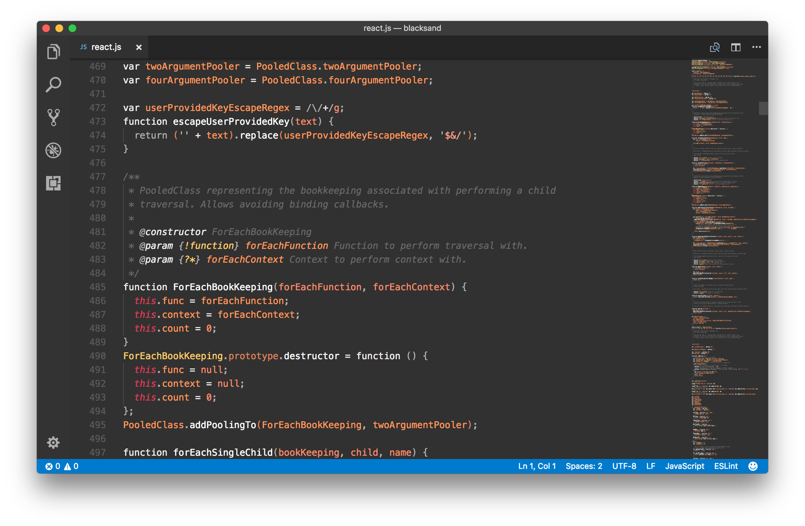
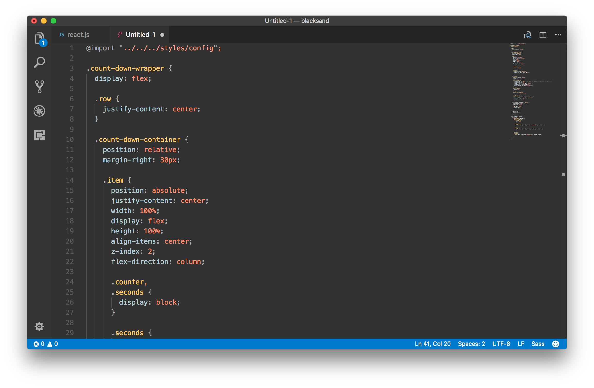

# BlackSand
## A theme inspired by the formation of black sand upon volcanic eruption."

* Tones of natural elements right off the bat: Fire (lava), air (smoke) and dark sand gives a natural experience.
* Theme is neutral of blue tones, making it easy on eyes for long-haul coding sessions.
* The colors picked from a real-life photograph taken by a resident of Hawaii Island - https://en.wikipedia.org/wiki/Black_sand#/media/File:Black_Sand_Forming.jpg

# 

# 

Author: Santhosh Sundar
URL: http://gigacore.in

Icon by: Bakunetsu Kaito

License: MIT